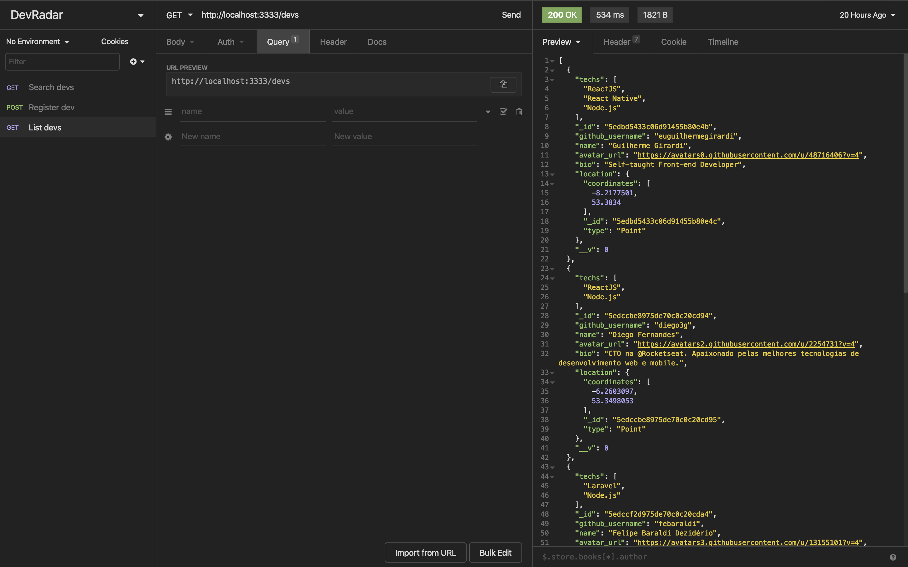
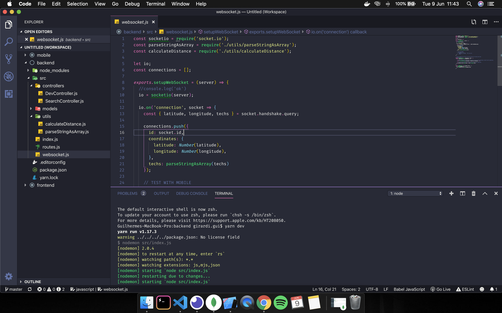

# DevRadar-Backend

This is the backend of the **DevRadar** project developed by [**_Rocketseat_**](https://rocketseat.com.br/), a Brazilian company that teaches Node.JS, ReactJS and React Native.
This is a project where I could learn many professional techniques that is used in "the real world".

## About the project

- The **DevRadar** is an application where you can search for developers within 10km around you.

## The backend

The backend was developed with [**_Node.js_**](https://nodejs.org/en/) and [**_Express.js_**](https://expressjs.com/) ( _framework_ ) using MVC as a design pattern. The application is based on a server which is the [**_MongoDB Atlas_**](https://www.mongodb.com/cloud/atlas).
The REST API was tested using [**_Insomnia_**](https://insomnia.rest/) and I also used [**_Mongoose_**](https://mongoosejs.com/), a library that facilitates the work with **_MongoDB_**.

**INSOMNIA**

**server.js**

## Getting started

1.  Prerequisites

- npm

      npm install npm@latest -g

2. Installation

- Clone the repo

      git clone https://github.com/euguilhermegirardi/DevRadar-Backend.git

3. Install NPM packages

       npm install

4. Run the application

       npm run dev

## Contributing

1.  Fork the project
2.  Create your feature branch (`git checkout -b feature/AmazingFeature`)
3.  Commit your changes (`git commit -m 'Add some AmazingFeature'`)
4.  Push to the branch (`git push origin feature/AmazingFeature`)
5.  Open a pull request

## License

